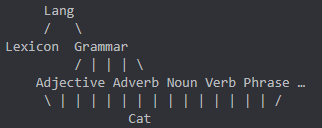

# Introduction

## Intended audience of this Readme

This Readme is designed for new developers who wish to either extend/improve on a resource grammar or create a new one. It provides an overview of the relationships between files and a simple working pipeline for developers to get started.

Note that while files in this folder are meant to be named with 3 letter suffixes representing the language, e.g. "ResBul" for the Bulgarian resource file, this Readme will use a 4 letter suffix "Lang" to represent a language in general, e.g. "ResLang".

## Author(s) of this Readme

This Readme was written by Nemo and edited by Inari on 14th August 2022.

# Creating a new resource grammar

If you are working on an RGL for a new language, you will need to run "Clone.hs" in the "src" folder so that you can clone a project from another language to your language to give you a basis to start with.

### From an existing RGL language

If your language already has a close relative in the RGL, then you can clone your language from that one, in order reuse the same structures with only minor modifications. As per the instructions, the syntax is `Clone fromdir todir fromlang tolang`.Suppose you want to clone Slovak from Czech, then do as follows:

```bash
$ runghc Clone czech slovak Cze Slo
```

You may want to add the option `--comment-body` after the word `Clone` to comment out every line in the body of the files.

```bash
$ runghc Clone --comment-body czech slovak Cze Slo
```

### From a generic template

Often it is easier to start from a rather clean slate, so the recommended way is to clone the [TEMPLATE](TEMPLATE/) module. So suppose you want to start a resource grammar for Albanian, do it as follows:

```bash
$ runghc Clone TEMPLATE albanian TMP Sqi
```

You will see more detailed instructions on how to continue from the cloned template in the [README file](template/README.md).

# File hierarchy

The number of files may be overwhelming, but they are related together following the graphic under "Module dependencies" under the rgl-tutorial. In the graphic, an example is that GrammarIta and ResIta are dependent on Prelude as they have arrows pointing towards the Prelude ellipse.

http://www.grammaticalframework.org/lib/doc/rgl-tutorial/index.html

The below graphic is an alternative graphic explaining the relations, taken from private correspondence with Inari.



CatLang defines the categories, and the modules AdjectiveLang, NounLang, SentenceLang, PhraseLang, and so on, all extend Cat. The Grammar is defined as a collection of all those AdjectiveLang, NounLang, SentenceLang, and so on modules. LangLang is defined as the collection GrammarLang and LexiconLang and is where you will be checking your program. You may ignore:

- AllLangAbs, AllLang, ExtendLang, ExtraLangAbs, ExtraLang, ConstructionLang, DocumentationLang, MarkupLang, BackwardLang

If the language you cloned from has any of these resource modules, you can remove them completely:

-  IrregLang (unless you want to populate it with irregular verbs of your own language), MissingLang (see how to generate your own if you need it later: https://inariksit.github.io/gf/2018/08/28/gf-gotchas.html#generating-missingxxx)

# Relationships between functions in files

There may be several ways the functions within the files are organised relative to one another. In other words, there may be several schemas depending on the author. More recent RGLs might implement one schema detailed by this blog post by Inari.
https://inariksit.github.io/gf/2018/08/28/gf-gotchas.html#my-naming-scheme-for-lincats-and-opers

# Main goal

You may think of your long-term goal as eventually implementing all the abstract functions found in the "abstract" folder. In other words, you are somewhat constrained by the available categories in Cat.gf and functions in relevant e.g. Noun.gf, Verb.gf etc. files.

In the future, if you find that the available functions do not apply to your language, you may search in the Extend.gf file for more optional functions, or in Extra.gf. if it doesn't exist, create your own ExtraLangAbs.gf with the concrete ExtraLang.gf, all in the same directory gf-rgl/src/lang. This blog post contains more information.

https://inariksit.github.io/gf/2021/02/15/rgl-api-core-extensions.html#language-specific-extra-modules

There is a prioritised list of RGL functions for new resource grammars written by contributor heatherleaf. You can start by implementing the "+++" functions.

https://github.com/GrammaticalFramework/gf-rgl/issues/238

# Working pipeline example

For a pipeline, You might wish to start with implementing functions that create Noun Phrase like DetCN: Det -> CN -> NP; a function that takes a Determiner and a Common Noun and gives a Noun Phrase. In this case, the workflow is done by editing:

1. ResLang: Contains the relevant Operations (Opers) for e.g. "Noun", "mkN",  "Determiner" and "Quant".
2. ParamLang: Contains the language paramters used in ResLang.
3. CatLang: CatLang will be defined in terms of Opers found in ResLang. This means that instead of Defining NP in CatLang as, say, {s: Str}, you will define NP as ResLang.NounPhrase, which points to a NounPhrase Oper in ResLang. Then you need to implement the word syntax in NounLang.
4. NounLang: Contains the relevant lins in defining sentence structure.
5. LexiconLang: Contains the lins that define the Noun words.

As you will have to define a determiner that is created from a Quant, you will have to look at the following files too.

6. StructuralLang: Contains the lins that define the Quant/Determiner words.

Note that you will have to use mkQuant instead of creating Det by mkDet directly.

# Testing your work

When you are done with your implementation, you may test that everything works by starting up LangLang and, in this case, writing something like:

```DetCN (DetQuant xxxx_Quant NumSg) (UseN xxxx_N)```

Where you replace 'xxxx' with the word in Lang.
